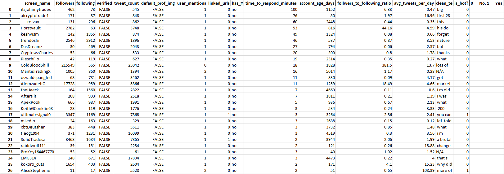
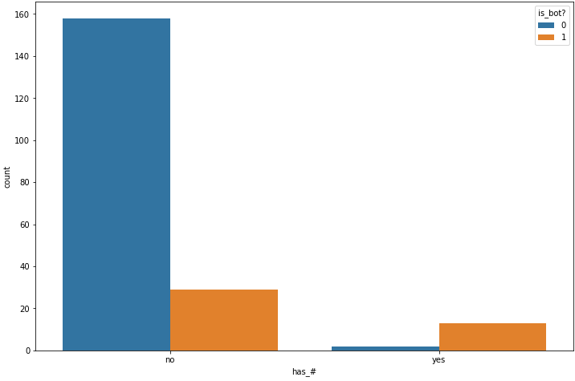
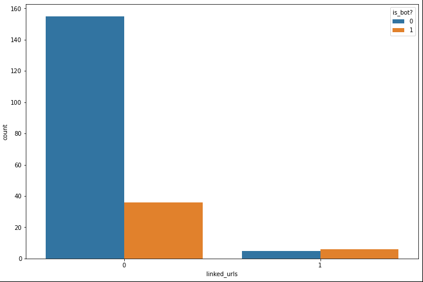
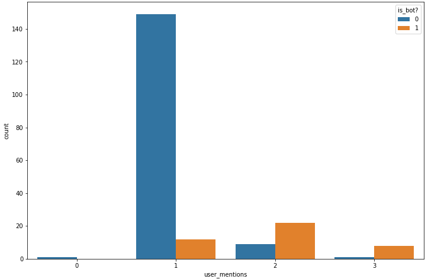
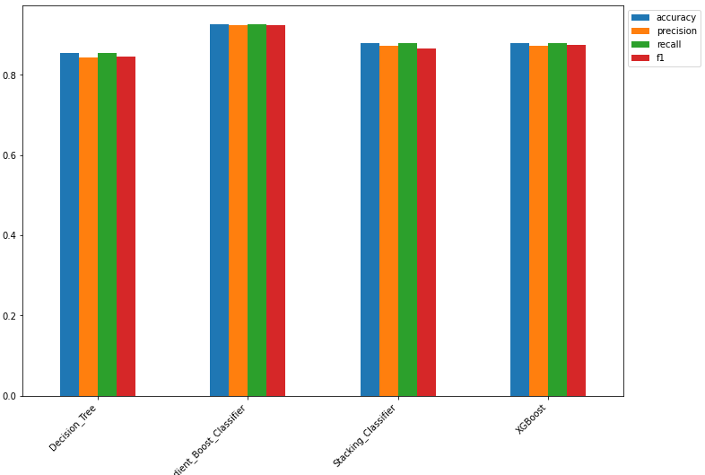
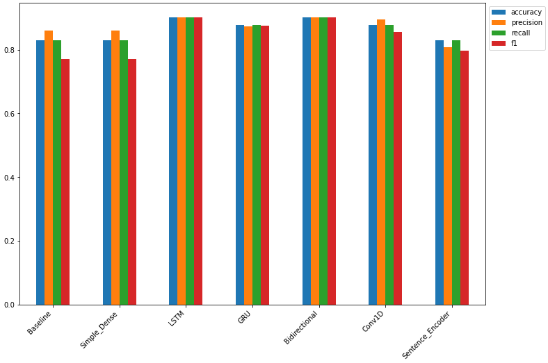

# Twitter-Spam-Detection-ML

This is a machine learning project dedicated to identifying spam replies to tweets on twitter. The main goal is to find the bot tweets that are attempting to scam/trick people in the comment section under tweets. I created this project from scratch, all the way from the data collection and cleaning process, to the modeling, tuning, and spam identification
>
The first notebook is 'data_collection' in this notebook, I created a script that pulls recent tweets from multiple accounts. From there, the replies under the tweet are pulled, and I then use that data from the twitter API to create the features that were going to use to identify the spam/ham tweets. The features that I looked at were number of followers, number of following, tweet count, whether the account had a default profile image, how many other users were mentioned in the reply tweet, if there were hashtags used in the reply, if there were any links in the reply tweet, the time to respond to the original tweet in minutes, the account age in days, the followers to following ratio, the average tweets per day, and finally the actual text of the tweet. The text of the tweets is cleaned using a function and the final dataframe is then written to an excel workbook where I went through each tweet personally to mark if it is spam (1), or not spam (0). Below you can see an example of the excel doc that contains just over 200 samples.
>

---
### Machine Learning Models
The 'ml_code' notebook contains all of the code for cleaning, scaling, and encoding the data so that it can be passed through machine learning models. Of all the features, from a quick glance, it seemed that the number of users mentioned in the reply, urls linked, and if the reply had hashtags were the most important features in determining if the reply was a bot.
>

>
The models that I used to evaluate the non-text features were a Tree Classifier, a GradientBoost Classifier, a Stacking Classifier (Logistic Regression, GradientBoost, Support Vector Classifier), and XGBoost. Of these models, the most succesful one was the GradientBoost Classifier, with an accuracy of roughly 92%. The performance of each model can be seen below:
>

---
### Deep Learning Models
Finally, I tried to differentiate between spam/ham by using solely the text of the reply itself, and using multiple types of text based deep learning models to predict on the data. The models that were used include a Naive Bayes model, a simple dense model, a LSTM model, a GRU model, a Bidirectional model, a convolutional neural network, and finally a neural network using googles universal sentence encoder as a layer. The best performing model was the LSTM model with an accuracy of roughly 90%. The performance of each model can be seen below:
>

